# Fourier Optics & Fourier Transform {ignore=true}

 
 
 
 
 
 
 
 
 

**Prof François Rigaut** 
Research School of Astronomy & Astrophycics 
The Australian National University

&copy; RIGAUT 2021, PHYS3057 FOURIER OPTICS

--

## Linear Optical Systems

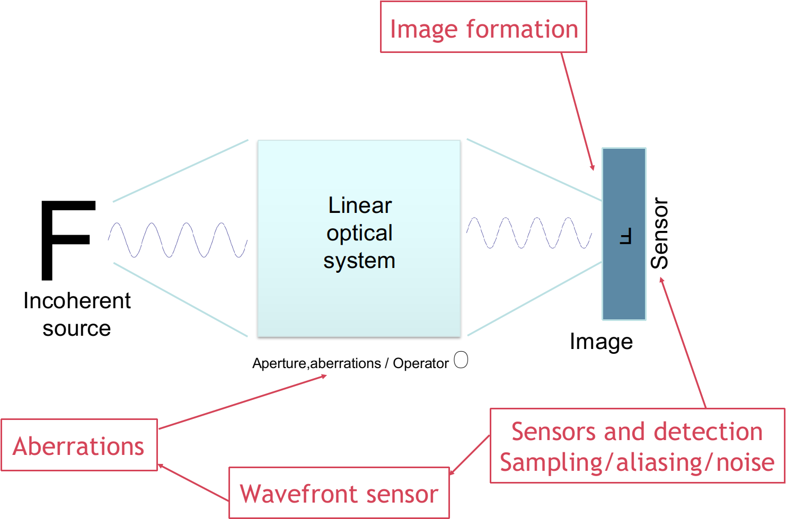

&copy; RIGAUT 2021, PHYS3057 FOURIER OPTICS

---

###### Preamble

--

## Introduction: Sources 

* “**Introduction to Fourier Optics and coherence**”, J.-M.Mariotti, in Diffraction limited imaging with very large telescope, editors D.M.Alloin and J.-M. Mariotti, 1988 (JMM), 
* “**Introduction to Fourier Optics**”, Joseph Goodman, 2004 (JG)
* “**Fundamental of Photonics**”, B.E.A Saleh & M.C.Teich, 1991, mostly Chapter 4 (S&T),
* “**Principles of Optics**”, Max Born and Emil Wolf, 1980 (B&W),
* “**Computational Fourier Optics: A MATLAB Tutorial**”, David Voelz
* The web, wikipedia.

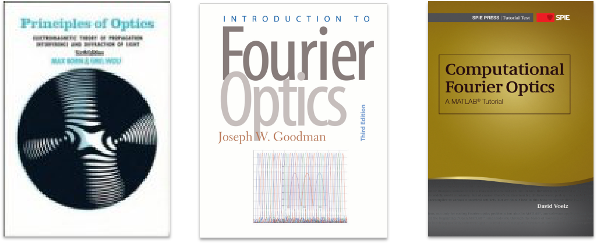

&copy; RIGAUT 2021, PHYS3057 FOURIER OPTICS

--

## History of Fourier Optics

* 1660: First observation of diffraction by **Grimaldi**
* 1678: **Huygens** “Traité de la lumière” (published 1690): first wave theory of light. Require finite  speed of light.
* 1803: **Thomas Young** two slits interferences experiment.
* 1818: **Fresnel** produces the first theory of diffraction.
* 1822: **Fourier** introduces his transform
* 1850-1950: **Krichhoff**, **Sommerfeld**, then Quantum Mechanics bring a firm mathematical foundation to the theory.

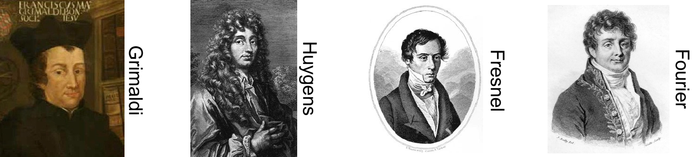

* Of course **Newton** was involved too !

&copy; RIGAUT 2021, PHYS3057 FOURIER OPTICS

--

## Validity and limit conditions

* Previous lectures from PHYS3057 were **1D optics, coherent** (waveguides, lasers). The next lectures with me will be on **2D optics, incoherent sources** (imaging). {style="margin-top:0.5em;"}
* We will consider **light as a scalar field** (B&W 8.4) {style="margin-top:0.5em;"}
* We’ll be focusing (pun intended) on **Fraunhofer diffraction** {style="margin-top:0.5em;"}
* **Diffraction occurs with all waves**, including sound, water, electromagnetic (X through radio), elementary particles. {style="margin-top:0.5em;"}
* We’ll **browse through the maths**, it is there for reference and those who’d like to dig deeper {style="margin-top:0.5em;"}

&copy; RIGAUT 2021, PHYS3057 FOURIER OPTICS

--

## Next two lectures in one slide {ignore=true}

* Basic understanding of the **Fourier transform** and its properties, **sampling and aliasing** issues

* In Fourier Optics, light is described by a scalar field $\Psi = A \exp^{i\varphi}$

* In **Fraunhofer diffraction**, the **far and near field** complex amplitudes are linked by a Fourier transform $\Psi\(P\) = {\cal F}(\Psi(M))$

* An optical system can be characterised by its **impulse function** $H$. The impulse function is $H = |{\cal F}\left(\Psi(x)\right)|^2$

* Object $O$ and image ${\cal I}$ are linked by the relation ${\cal I} = O \ast H$

* The Optical Transfer Function of a system characterises its spatial frequencies filtering properties ${\rm OTF} = {\cal F}(H) = \Psi \ast \Psi^\star$

&copy; RIGAUT 2021, PHYS3057 FOURIER OPTICS

---

###### Introduction to modal expansion

--

## Modal Expansion
<!-- @import "assets/css/bigkatex.less" -->

 

$$\Huge f = \sum_i a_i \mu_i$$

<!-- @import "assets/css/regkatex.less" -->

where:
* $f$ is a discrete function/object
* $\mu_i$ are modes that you are going to use to represent
* $a_i$ are the coefficients

&copy; RIGAUT 2021, PHYS3057 FOURIER OPTICS

--

## Modal expansion

* The nature world is **continuous**
* Once measured, a **signal is discrete**.
  * Volt versus time
  * Elevation map
  * Image
* Chose the **modal basis** adapted to your problem.
* Goal is to try to **reduce the number of parameter** to describe function, and make use of convenient properties of this description
* Examples:
  * An optical phase using Zernike modes $\varphi = \sum_i a_i Z_i$
  * Finite Element Model analysis
  * Eigenvalues engenmodes
* Cyclic signals are naturally described by expanding on **sines and cosines**  $\rightarrow f = \sum_i a_i \cos(i\theta) + b_i \sin(i\theta)$

&copy; RIGAUT 2021, PHYS3057 FOURIER OPTICS

---

###### The Fourier Transform

--

## What is the Fourier Transform?

* The Fourier transform of a signal tells you **what frequencies are present in your signal and in what proportions**

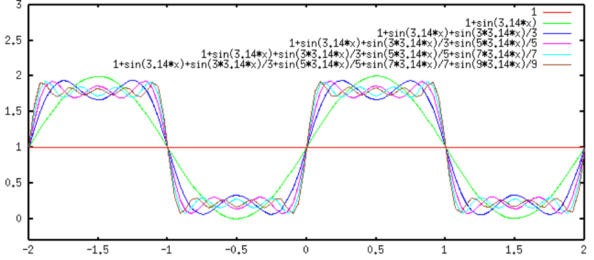

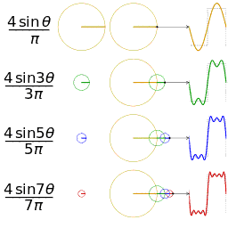

* IMHO, the **most useful mathematical tool for engineers and applied physicists**.
* It is used to:
  * **Characterise signals** (1D/2D..) and linear systems. Electronics, optics, acoustics, mechanics, civil engineering, etc, etc…
  * **Digitally process data/signals** (filtering, convolving, correlating, etc) in all above disciplines

&copy; RIGAUT 2021, PHYS3057 FOURIER OPTICS

--

## Fourier Filtering

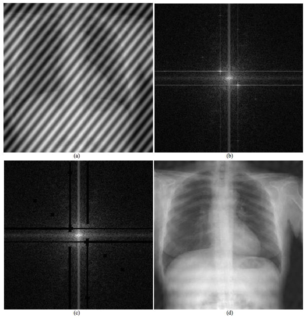

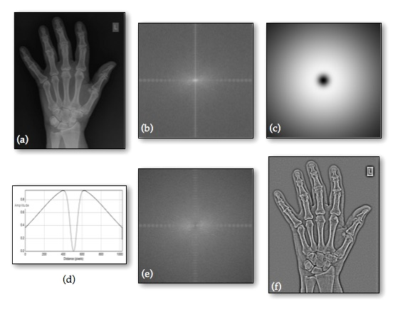

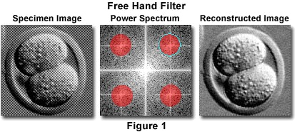

&copy; RIGAUT 2021, PHYS3057 FOURIER OPTICS

--

## Fourier transform: definitions

* We note $\hat{f}$ the **Fourier transform** of $f$
$$\hat{f}(u) = \int_{-\infty}^{+\infty} f(x) \exp^{-i2\pi ux} dx$$
* The **inverse** Fourier transform is $f(x) = \int_{-\infty}^{+\infty} \hat{f}(u) \exp^{+i2\pi ux} du$
* We will also use the **Fourier operator** ${\cal F}$: $\hat{f}(u) = {\cal F}[f(x)]$
* The Fourier transform is **cyclic**: ${\cal F}^{-1}[{\cal F}[f(x)]] = f(x)$
* To have a Fourier transform, a function must
  * Be absolutely integrable $$ \left| \int_{-\infty}^{+\infty} f(x) dx \right| < \infty $$
  * Not have any infinite discontinuity
  * Have only a finite number of discontinuities or extrema in any finite interval

&copy; RIGAUT 2021, PHYS3057 FOURIER OPTICS

--

## Fourier Pairs

  
| Function | Fourier Pair |
|  --- | --- |
| $\exp(-\pi x^2)$ | $\exp(-\pi u^2)$ |
| ${\rm sinc}(x)$ | $\Pi(u)$ |
| ${\rm sinc}^2(x)$  | $\Lambda(u)$  |
| $\delta(x)$  | $1$   |
| ${\rm III}(x)$ | ${\rm III}(u)$ |
| $\sin(\pi x)$ | $\frac{i}{2} \delta (u+\frac{1}{2}) - \frac{i}{2} \delta (u-\frac{1}{2})$ |

&copy; RIGAUT 2021, PHYS3057 FOURIER OPTICS

--

## Properties

| Property | Expression |
| --- | --- |
| **Linearity** |  if $h(x) = a f(x) + b g(x)$ then $\hat{h}(u) = a \hat{f}(u) + b \hat{g}(u)$ |
| **Similarity** | ${\cal F}[f(ax)] = \frac{1}{ \lvert a \rvert } \hat{f} \left( \frac{u}{a} \right)$ |
| **Shift** | ${\cal F}[f(x-a)] = e^{-i2\pi a u} \hat{f}(u) $ |
| **Convolution** | ${\cal F}[f(x)\ast g(x)] = {\cal F}[f(x)] \times {\cal F}[g(x)] = \hat{f}(u) \times \hat{g}(u) $  |
| **Autocorrelation**  | ${\cal F}[f(x)\ast f(x)] = \lvert \hat{f}(u) \rvert^2 $ |
| **Parseval** | $\int_{-\infty}^{+\infty} f(x) \times g^\ast(x) dx = \int_{-\infty}^{+\infty} \hat{f}(u) \times \hat{g}^\ast(u) du $ |
| **Power** | $\int_{-\infty}^{+\infty} \lvert f(x) \rvert^2 dx = \int_{-\infty}^{+\infty} \lvert \hat{f}(u) \rvert^2 du $  |
| **Derivative** |  $ {\cal F}\left[ \frac{d}{dx} f(x) \right] = i2\pi u \hat{f}(u) $  |

&copy; RIGAUT 2021, PHYS3057 FOURIER OPTICS

---

###### 2D FT, DFT, FFT, PSD

  
* Acronyms:
  * FT: Fourier Transform
  * DFT: Discrete FT
  * FFT: Fast FT
  * PSD: Power Spectral Density (modulus square)

--

## 2D Fourier transform

|  |  |
| --- | --- |
| **Forward** | $$\hat{f}(u,v) = \iint_{-\infty}^{+\infty} f(x,y) e^{-i2\pi (ux+vy)}  dx  dy$$ |
| **Reverse** | $$f(x,y) = \iint_{-\infty}^{+\infty} \hat{f}(u,v) e^{+i2\pi (ux+vy)}  du  dv   $$ |
| | |

* Note that if $f$ can be factorised (convenient)
$f(x,y) = g(x).h(y)$ then $\hat{f}(u,x) = \hat{g}(u) \times \hat{h}(v)$
  * (but if $f(x,y) = g\(r\).h(\theta)$ the problem is more complicated ...)
* All other theorems apply as in 1D (linearity, similarity, power, etc) 

&copy; RIGAUT 2021, PHYS3057 FOURIER OPTICS

<!-- 

 -->

--

## Some 2D Fourier pairs

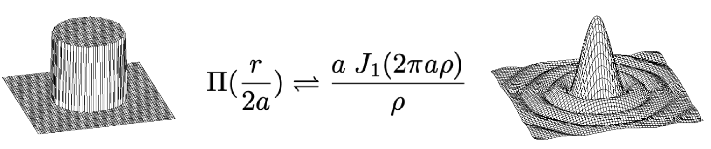
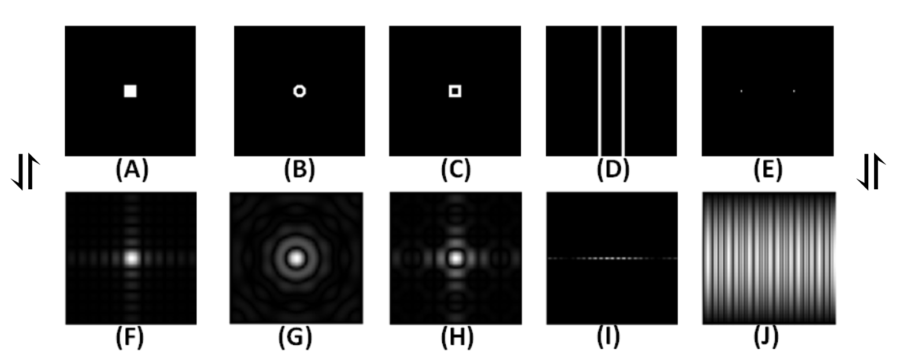

&copy; RIGAUT 2021, PHYS3057 FOURIER OPTICS

--

## Discrete FT and Fast FT

* The Fourier transform can be modified for **discrete datasets**, which is extremely useful to represent and analyse **sampled physical signals**. The discrete Fourier transform (DFT) is:
$$\begin{aligned} \hat{f}(\nu) & = \frac{1}{N} \sum_{\tau=0}^{N-1} f(\tau) e^{-i2\pi\nu\tau/N} \\\\ f(\tau) & = \sum_{\nu=0}^{N-1} \hat{f}(\nu) e^{+i2\pi\nu\tau/N} \end{aligned}$$
* Both $\tau$ and $\nu$ are discrete variables. Both functions consist of sequences of N samples. All the basic theorems for the FT also apply to the DFT.
* The **Fast Fourier Transform (FFT)** is a DFT that uses a smart algorithm to drastically reduce the number of operations, from **$N^2$ down to $N \log(N)$**

&copy; RIGAUT 2021, PHYS3057 FOURIER OPTICS

--

## The Power Spectral Density (PSD)

* The square modulus of the Fourier transform of a signal
$${\rm PSD}(f) = |{\cal F}(f(x))|^2$$
* PSD is insensitive to the phase of the input signal.
  * you get the power (intensity) per frequency bin over the frequency range 0 to cut off frequency
* In a DFT, assuming:
  * the units of x are seconds (s),
  * and the units of f, say, Volts (V)
  * then the PSD units are V$^2$/Hz.

See Spectrum Density Analyser

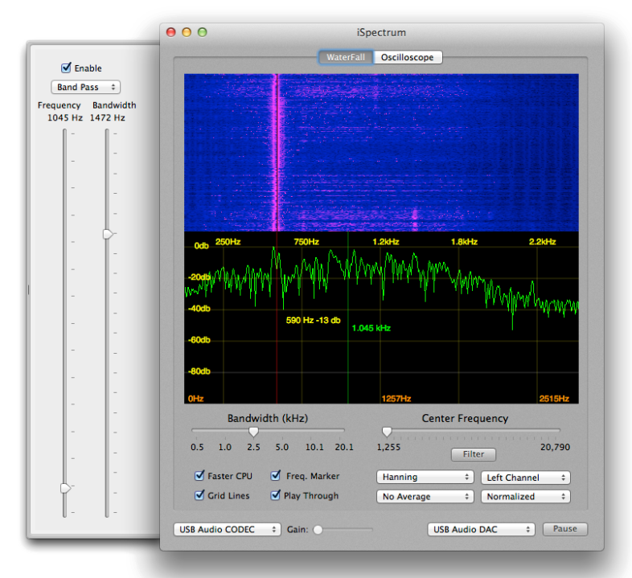

&copy; RIGAUT 2021, PHYS3057 FOURIER OPTICS

---

###### Diffraction Theory

--

## Huygens Principle

* “*Every point on a wavefront may be considered a source of secondary spherical wavelets which spread out in the forward direction at the speed of light. The new wavefront is the tangential surface to all of these secondary wavelets.*”

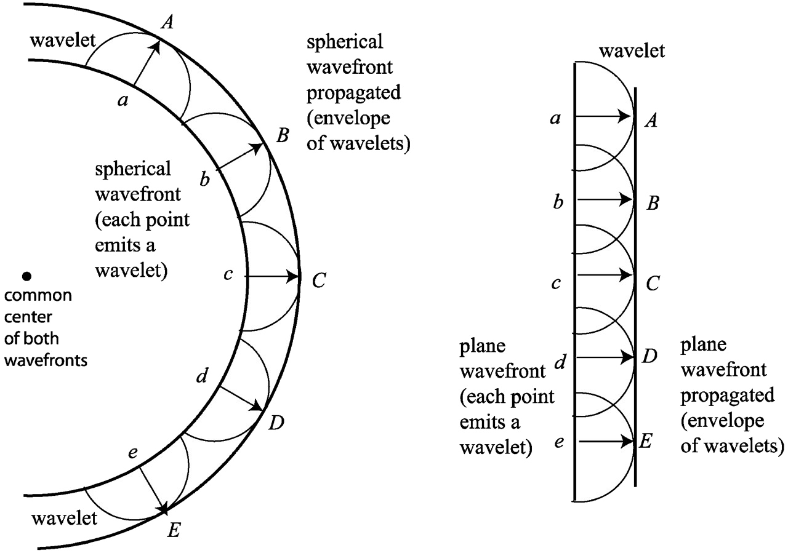

&copy; RIGAUT 2021, PHYS3057 FOURIER OPTICS

--

## (Non) Derivation of the diffracted field

|  |  |
| --- | --- |
|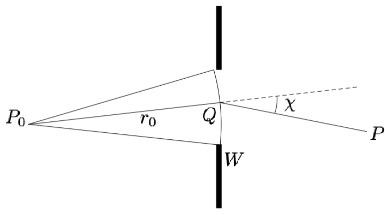 | 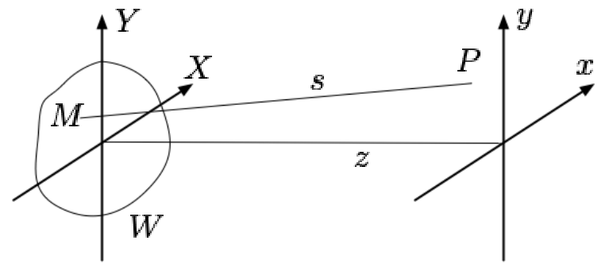 |

* Fresnel, KrichHoff and Sommerfeld, within others, have worked out the math. It's messy, and requires a lot of approximations.
* Applying the Huygens principle and working out the field propagation from the point $P_0$ through the aperture $W$ in plan $M$ (near field), to the final plan $P$ (far field), it can be demonstrated that the **field in $P$ is the simple Fourier Transform of the field in $M$**:

$$\huge \Psi \(P\) = {\cal F}(\Psi \(M\))$$

&copy; RIGAUT 2021, PHYS3057 FOURIER OPTICS

<!--
## Derivation of the Diffracted Field  

* Consider a monochromatic light emitted from $P_0$ toward the aperture $W$ 
* What is the field in $P$?
* At $Q$, the spherical wave coming from $P_0$ is $\Psi(Q) = A \frac{e^{ikr_0}}{r_0}$ where $A$ is the amplitude and $k = 2\pi /\lambda$ (wavelength)
* Applying Huygens principle, Q, the secondary source, sends a new spherical wavelet to $P$. The contribution of the area $dS$ around $Q$ is $$ d\Psi\(P\) = A \frac{e^{ikr_0}}{r_0}.K(\chi) \frac{e^{iks}}{s} dS$$ where $K(\chi)$ is a scaling factor (maximum for $\chi=0$ and null for $\chi=\pi/2$). Integrating over the aperture: $$ \Psi\(P\) = A \frac{e^{ikr_0}}{r_0} \iint_W K(\chi) \frac{e^{iks}}{s} dS$$

## Derivation of the Diffracted Field  

* Using qualitative arguments, Fresnel derives $K(\chi) = 1/(i\lambda) \cos(\chi)$ (confirmed by Kirchhoff and Sommerfeld later). We use the Rayleigh-Sommerfeld expression
$$ \Psi \(P\) = \frac{A}{i\lambda} \frac{e^{ikr_0}}{r_0} \iint_W  \frac{e^{iks}}{s} \cos(\chi) dS$$
* or, equivalently
$$ \Psi \(P\) = \frac{1}{i\lambda} \iint_W  \Psi(M) \frac{e^{iks}}{s} \cos(\chi) dS$$
with
$$ \Psi (M) = \begin{cases} 
A \frac{e^{ikr_0}}{r_0} &\text{if } M \in W \\\\ 
0 &\text{if }  M \notin W 
\end{cases} $$

## Derivation of the Diffracted Field

Further assumption and approximations
* Plane geometry
* Small diffraction angles so that $K(\chi) \approx 1$
* Size of $W << s$; Thus $$\Psi\(P\) \frac{1}{i \lambda z} \iint_{-\infty}^{+\infty} \Psi(M) e^{iks} dX dY $$
* Furthermore, we have $s = z \left[ 1 + \left(\frac{x-X}{z} \right)^2 + \left(\frac{y-Y}{z} \right)^2  \right]^{1/2} $

-->

---

###### Wavefront, PSF, OTF

--

## The Impulse Function

* Recalling the field in P: $\Psi\(P\) = {\cal F}(\Psi(M)) $
* At visible wavelengths, it is extremely difficult to measure the complex field itself (for quantum noise reasons) - but we can measure the field intensity (irradiance), the square of the complex field. H is the image of a point, the impulse function, also called the **Point Spread Function (PSF)**:

$$H = \Psi\(P\).\Psi^\ast\(P\) = {\cal F}(\Psi(M)).{\cal F}^\ast(\Psi(M)) = |{\cal F}(\Psi(M))|^2$$

Remember that $\Psi = A e^{i \varphi}$? So, in absence of aberrations ($\varphi\equiv0$), we simply have:
$$ H = | {\cal F}(A) |^2 $$

&copy; RIGAUT 2021, PHYS3057 FOURIER OPTICS

--

## The Impulse Function, circular aperture

For a circular aperture:
 $$ \Psi(M) = \Psi(r,\theta) = \Pi \left(\frac{r}{2a} \right) =  
\begin{cases} 
1 &\text{if } r\le a \\\\ 
0 &\text{if }  r > a 
\end{cases}$$

$$ H = | {\cal F}(\Psi(M))|^2 = | {\cal F}(\Psi(\Pi (r/2a)))|^2 = \left[ a \frac{J_1(2\pi a \rho)}{\rho} \right]^2$$

&copy; RIGAUT 2021, PHYS3057 FOURIER OPTICS

--

## An Application: Young Fringes

* Armed with this new mathematical description of diffraction, it is now trivial to find, e.g., the expression of the Young fringes.
* The slits can be described  as a convolution:

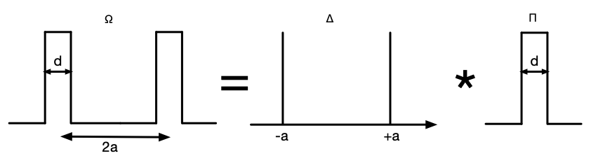

 
 
 

* The near field can be written $\small \Omega(x) = \Delta(x/a) \ast \Pi(x/d)$
* The far field is $\small \hat{\Omega}(u) = {\cal F}(\Delta(x/a) \ast \Pi(x/d)) = {\cal F}(\Delta(x/a)) \times {\cal F}(\Pi(x/d)) $
* $\small \Delta(x/a) = \delta(x-a)+\delta(x+a)$ hence 
$\small {\cal F}(\Delta(x/a)) = e^{-i2\pi au}+e^{+i2\pi au} = 2 \cos(2\pi au)$
* and $\small {\cal F}(\Pi(x)) = {\rm sinc}(u)$ hence $\small {\cal F}(\Pi(x/d)) = {\rm sinc}(ud)$

Thus $\small \hat{\Omega}(u) = 2 \cos(2\pi au) \times {\rm sinc}(ud)$ and the intensity (measured) 
$$|\hat{\Omega}(u)|^2 = 4 \cos^2(2\pi au) \times {\rm sinc}^2(ud) $$

&copy; RIGAUT 2021, PHYS3057 FOURIER OPTICS

--

## Airy pattern, circular aperture PSF

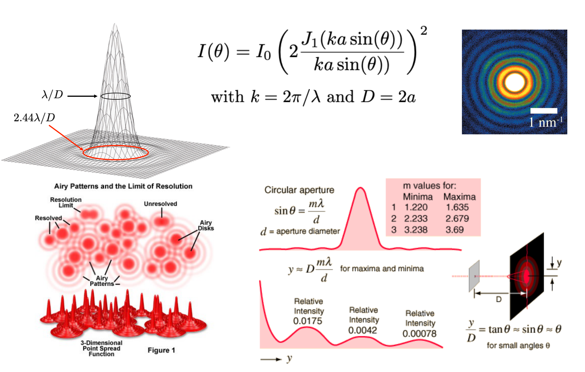

&copy; RIGAUT 2021, PHYS3057 FOURIER OPTICS

--

## The Optical Transfer Function

* Also called generically **Modulation Transfer Function (MTF)**
$${\rm OTF} = |{\cal F}(H)| = |\Psi \ast \Psi^*| $$
* Characterises the filtering properties of an optical system, including cut-off frequency
* For a circular aperture, the cut-off frequency is $f_c = D/\lambda$
* People have written books about it…
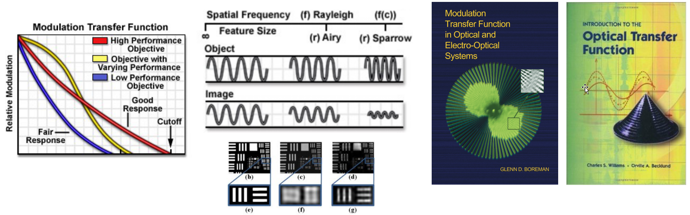

&copy; RIGAUT 2021, PHYS3057 FOURIER OPTICS

--

## Wavefront, PSF & OTF are linked

* The wavefront is $\Psi(x,y,t) = A(x,y,t) \exp( i \varphi(x,y,t))$
  * $\Psi$ is the complex field defined by its amplitude and phase
  * $A$ is the amplitude (e.g. pupil function)
  * $\varphi$ is the phase
* The Optical Transfer Function (or MTF) is the spatial frequency response of the system.
* **Wavefront, PSF and OTF are linked**:
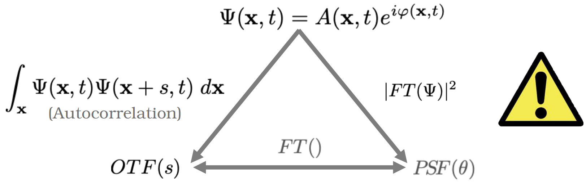

&copy; RIGAUT 2021, PHYS3057 FOURIER OPTICS

---

###### Interferometry to Imaging ...and Back

--

## Image formation for incoherent sources {style="font-size:1.3em;"}

* An 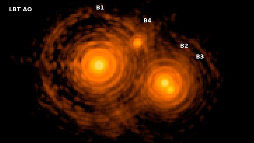object O can be decomposed into an infinite number of dirac function. In the case of an incoherent object (most objects in everyday’s life, astronomical objects, medicine,etc), these points **do not interfere**, thus the resulting image is the convolution of the object and the impulse response (PSF)
$$ \Large {\cal I} = O * H$$

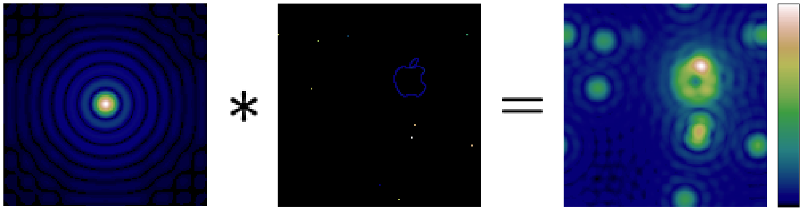

Note that this assumes isoplanaticity (invariance of PSF with position in the field of view) {style="font-size:0.6em;"}

&copy; RIGAUT 2021, PHYS3057 FOURIER OPTICS

--

## Interferometry to Imaging...

* From "slit" to full aperture

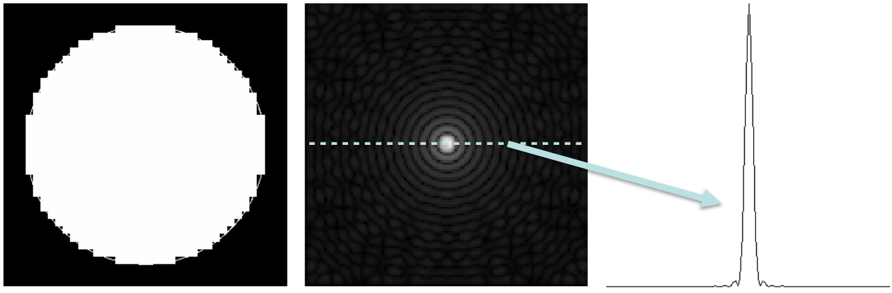

Near field = Aperture = Pupil
 

Far field = Focal plane Image
 

Image cross section
 

&copy; RIGAUT 2021, PHYS3057 FOURIER OPTICS

--

## Interferometry to Imaging...

* From "slit" to full aperture

<video controls>
  <source src="assets/images/anim_1.mp4" type="video/mp4">
</video>

Near field = Aperture = Pupil
 

Far field = Focal plane Image
 

Image cross section
 

&copy; RIGAUT 2021, PHYS3057 FOURIER OPTICS

--

## ... and Imaging to Interferometry

| | |
| --- | --- |
| 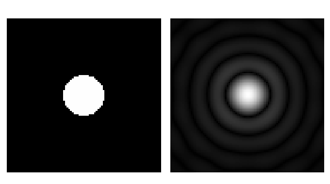 | 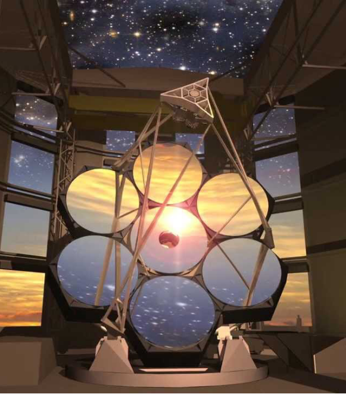 |

&copy; RIGAUT 2021, PHYS3057 FOURIER OPTICS

--

## ... and Imaging to Interferometry

| | |
| --- | --- |
| 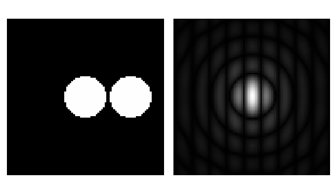 |  |

&copy; RIGAUT 2021, PHYS3057 FOURIER OPTICS

--

## ... and Imaging to Interferometry

| | |
| --- | --- |
| 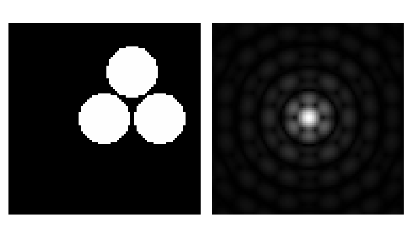 |  |

&copy; RIGAUT 2021, PHYS3057 FOURIER OPTICS

--

## ... and Imaging to Interferometry

| | |
| --- | --- |
| 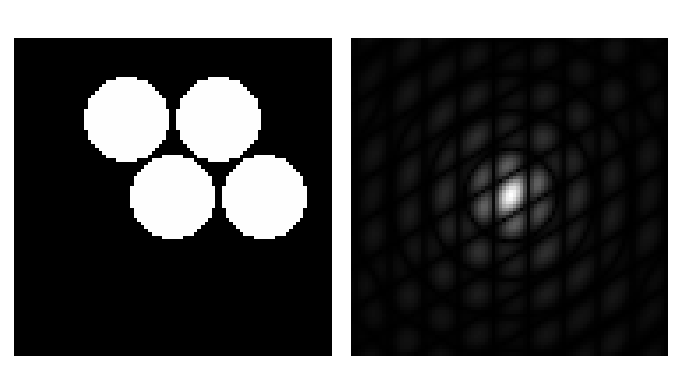 |  |

&copy; RIGAUT 2021, PHYS3057 FOURIER OPTICS

--

## ... and Imaging to Interferometry

| | |
| --- | --- |
| 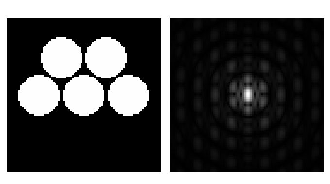 |  |

&copy; RIGAUT 2021, PHYS3057 FOURIER OPTICS

--

## ... and Imaging to Interferometry

| | |
| --- | --- |
| 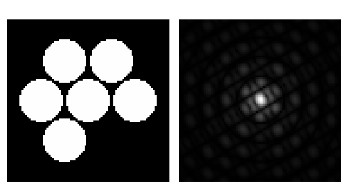 |  |

&copy; RIGAUT 2021, PHYS3057 FOURIER OPTICS

--

## ... and Imaging to Interferometry

| | |
| --- | --- |
| 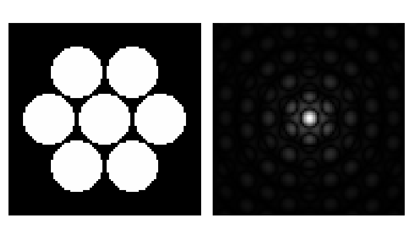 |  |

&copy; RIGAUT 2021, PHYS3057 FOURIER OPTICS

---

###### Elements of Sampling Theory

--

## Sampling & Aliasing (Shannon/Nyquist)

> If a continuous, band-limited function $f(x)$ contains no frequency component higher then $f_c$ , then it can be fully specified by a set of samples at frequency of $2\times f_c$ or larger. {style="margin-top: 100px; font-size:160%;"}

&copy; RIGAUT 2021, PHYS3057 FOURIER OPTICS

--

## The Shah function ${\rm III}(x)$

1. ${\rm III}(x)$ is its own Fourier transform
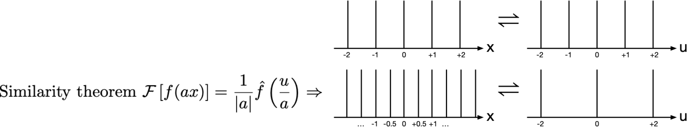
2. The act of sampling is taking value at discrete points $\equiv$ Multiplication by ${\rm III}$
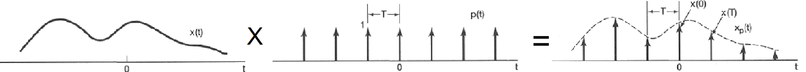
3. Convolution by ${\rm III}$ is equivalent to creating an infinite number of shifted replicas of the original functions
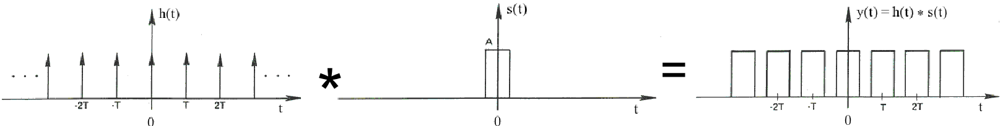

&copy; RIGAUT 2021, PHYS3057 FOURIER OPTICS

--

## Aliasing

Fourier view: In the DFT/FFT space, the function spectrum is replicated at intervals $2\times fc$. If the spectrum spills over $\pm fc$, then the spectrum replicas will overlap, resulting in a mixed signal (original lost).

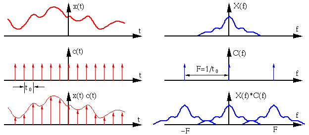

&copy; RIGAUT 2021, PHYS3057 FOURIER OPTICS

--

## Aliasing

* Can 
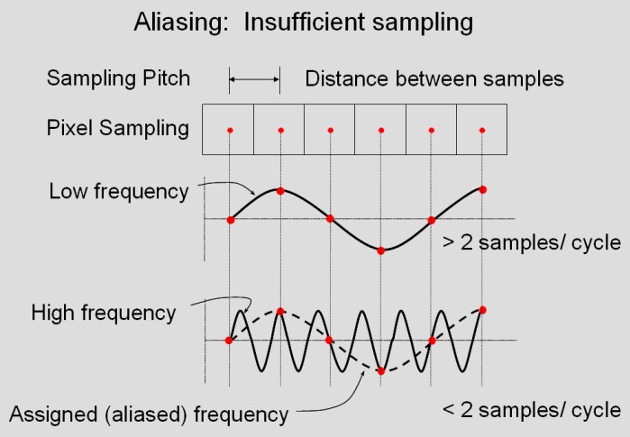
 be spatial, temporal, angular, etc
* Can be solved/mitigated by pre-filtering the signal before sampling

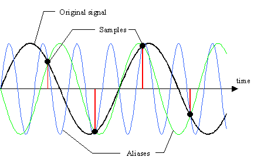

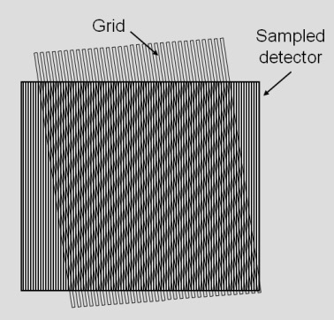

&copy; RIGAUT 2021, PHYS3057 FOURIER OPTICS

--

## proof of the sampling theorem

From $f(x)$ we obtain the sampled $f_s(x)$ with sampling interval $\tau$ by:
$$ f_s(x) = {\rm III}\left(\frac{x}{\tau}\right).f(x) $$
In the Fourier domain:
$$ \hat{f_s} (u) = \tau \\; {\rm III}(\tau u) \ast \hat{f}(u) = \tau \sum\_{-\infty}^{+\infty} \hat{f}\left( u - \frac{n}{\tau}\right)$$
The spectrum of the sampled function consists of an infinite sum of replicas of $\hat{f}(u)$. If $\tau^{-1} < 2 f_c$, the replicas are separated by distances larger then their width and do not overlap (if not, they do and it creates in aliasing). Hence the information on $\hat{f}(u)$ and thus on $f(x)$ is preserved if the sampling condition $\tau \le 1/(2 f_c)$ is met. We can retrieve the original spectrum by multiplying $\hat{f}(u)$ by a rectangle function (gate) $\Pi(\tau u)$ in order to eliminate all replica but one: 
$$ \left[ \tau \\; {\rm III}(\tau u) \ast \hat{f}(u) \right]. \Pi(\tau u) = \hat{f}(u) $$
which yields by inverse Fourier transform
$$ \left[  {\rm III}(x/\tau).f(x) \right] \ast \tau^{-1} {\rm sinc}(x/\tau) = f_s(x) \ast \tau^{-1} {\rm III}(x/\tau) = f(x)$$
{style="font-size:80%;"}

&copy; RIGAUT 2021, PHYS3057 FOURIER OPTICS

--

<video controls>
  <source src="assets/images/aliasing2.mp4" type="video/mp4">
</video>

---

## Main points of past two lectures

* Basic understanding of the **Fourier transform** and its properties, **sampling and aliasing** issues

* In Fourier Optics, light is described by a scalar field $\Psi = A \exp^{i\varphi}$

* In **Fraunhofer diffraction**, the **far and near field** complex amplitudes are linked by a Fourier transform $\Psi\(P\) = {\cal F}(\Psi(M))$

* An optical system can be characterised by its **impulse function** $H$. The impulse function is $H = |{\cal F}\left(\Psi(x)\right)|^2$

* Object $O$ and image ${\cal I}$ are linked by the relation ${\cal I} = O \ast H$

* The Optical Transfer Function of a system characterises its spatial frequencies filtering properties ${\rm OTF} = {\cal F}(H) = \Psi \ast \Psi^\star$

&copy; RIGAUT 2021, PHYS3057 FOURIER OPTICS

